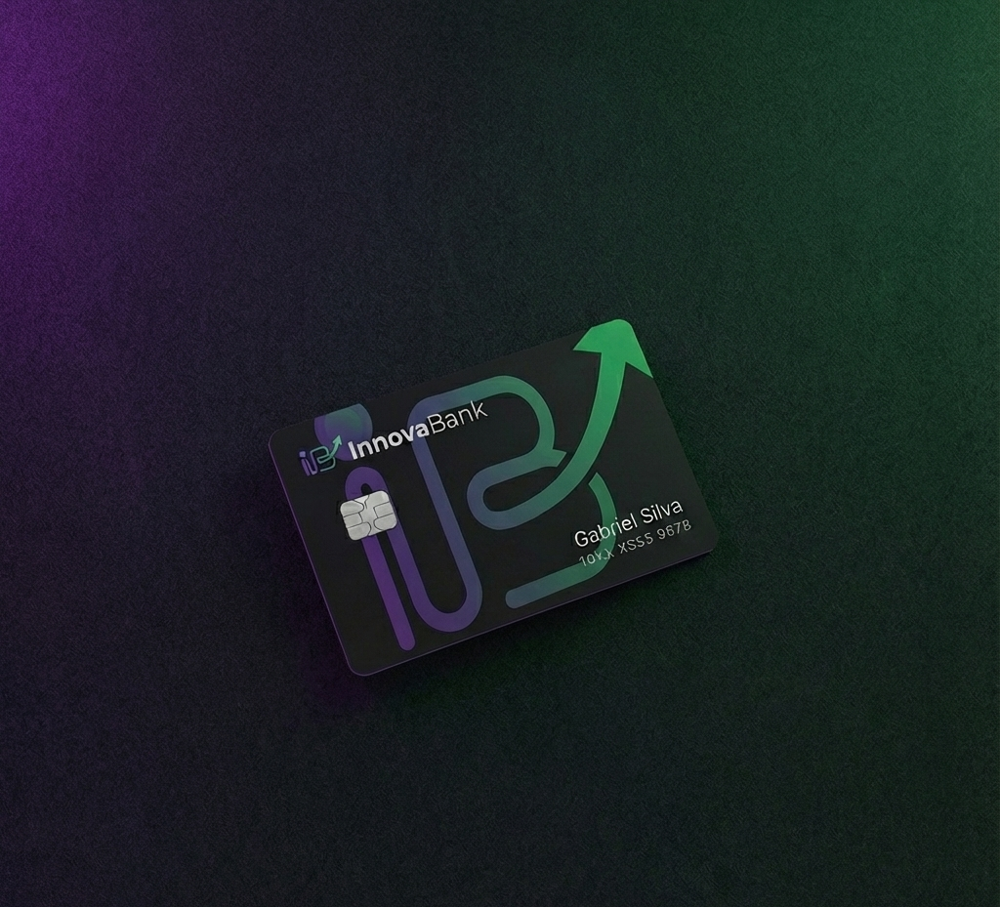
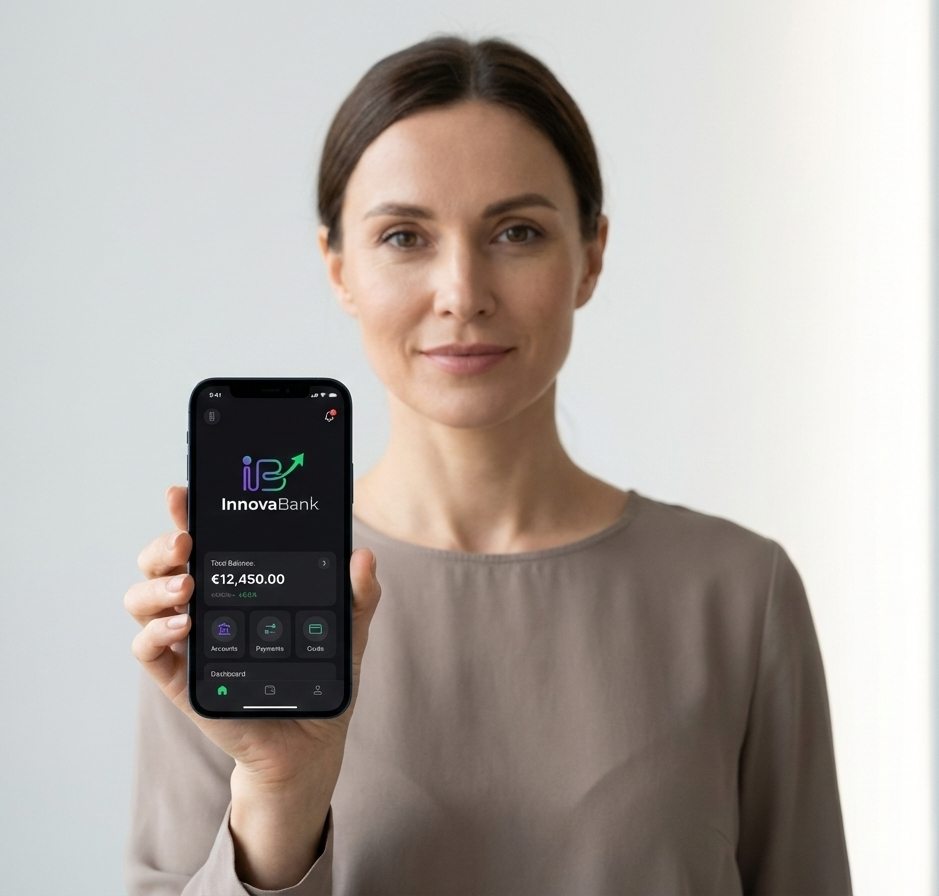

# 🚀 InnovaBank - Landing Page Financeira

<div align="center">
  
  <br>
  <h3>O banco digital feito para freelancers, PJ e nômades digitais.</h3>
  <br>
  
  <p>
    <a href="#-sobre-o-projeto">Sobre</a> •
    <a href="#-features-e-diferenciais">Features</a> •
    <a href="#-tecnologias">Tecnologias</a> •
    <a href="#-galeria">Galeria</a> •
    <a href="#-como-rodar">Como Rodar</a>
  </p>
</div>

---

## 💡 Sobre o Projeto

O **InnovaBank** é uma Landing Page de alta conversão desenvolvida para uma Fintech fictícia. O objetivo do projeto foi criar uma experiência de usuário **moderna, fluida e interativa**, fugindo do padrão institucional e focando na identidade visual "Cyberpunk/Tech" que atrai o público de desenvolvedores e nômades digitais.

Diferente de sites estáticos comuns, este projeto implementa lógica de negócios real no Front-end, permitindo que o usuário interaja com a plataforma para simular economias reais.

---

## ⚡ Features e Diferenciais

O projeto foi construído com foco em **UI Design Avançado** e **Engenharia de Software**:

* **🧮 Calculadora de Economia (Real-time):** Lógica em JavaScript que captura o input do usuário e calcula instantaneamente a diferença de taxas (Spread) entre bancos tradicionais e o InnovaBank, formatando para moeda local (BRL) automaticamente.
* **📱 Responsividade Extrema:** O layout se adapta perfeitamente a qualquer dispositivo. No mobile, a interface muda drasticamente (menu oculto, grid vira flex column) para priorizar a conversão (Mobile First).
* **🎨 UI Design Moderno:**
    * **Glassmorphism:** Efeito de vidro fosco nos cartões.
    * **Neon Glow:** Bordas com gradientes animados e sombras coloridas.
    * **Dark Mode Nativo:** Paleta de cores escura (`#121214`) para conforto visual e estética premium.
* **✨ Micro-interações e Animações:**
    * **Marquee Infinito:** Faixa de texto em loop contínuo feito puramente com CSS Keyframes.
    * **3D Hover Effects:** Cartões que flutuam, giram e acendem ao passar o mouse.
    * **Shimmer Effect:** Textos com brilho metálico passando pela tipografia.

---

## 🛠 Tecnologias

O projeto foi desenvolvido sem frameworks pesados para garantir performance máxima e demonstrar domínio da base da Web:

* **HTML5 Semântico:** Estrutura acessível e organizada (SEO friendly).
* **CSS3 Avançado:**
    * `Flexbox` & `Grid Layout` para arquitetura.
    * `CSS Variables` (`:root`) para consistência de design system.
    * `@media queries` para responsividade complexa.
    * `Keyframes` para animações de alta performance (GPU).
* **JavaScript (ES6+):** Manipulação do DOM, Event Listeners e lógica matemática para o simulador.

---

## 📸 Galeria do Projeto

### 🖥️ Hero Section & Identidade Visual
*Visual impactante com tipografia brilhante e elementos flutuantes.*
<div align="center">
  
</div>

### 🧮 O Diferencial: Simulador Interativo
*Calculadora programada em JS que converte Dólar para Real em tempo real, mostrando a economia.*
<div align="center">
  
</div>

### 💳 Ecossistema e Cartões 3D
*Seção com animações de levitação e máscaras de recorte avançadas (CSS Masking).*
<div align="center">
  
</div>

### 📱 Responsividade (Mobile)
*Layout adaptado para telas verticais, com foco total em UX.*
<div align="center">
  
</div>

---

## 🚀 Como Rodar o Projeto

Este é um projeto estático, então você não precisa instalar dependências (Node, NPM, etc).

1.  **Clone o repositório:**
    ```bash
    git clone [https://github.com/jaquelinedaniel-pt/innovabank.git](https://github.com/jaquelinedaniel-pt/innovabank.git)
    ```
2.  **Abra a pasta do projeto:**
    ```bash
    cd innovabank
    ```
3.  **Abra o arquivo `index.html`** no seu navegador preferido (Chrome, Edge, Firefox).
    * *Dica: Se usar VS Code, instale a extensão "Live Server" para ver as alterações em tempo real.*

---

<div align="center">
  <p>Desenvolvido com 💜 e muita lógica por <strong>Jaqueline Daniel</strong></p>
  
  <a href="https://www.linkedin.com/in/jaquelinedaniel-pt" target="_blank">
    
  </a> 
  <a href="mailto:jaquelinedaniel.pt@GMAIL.COM">
    
  </a>
</div>